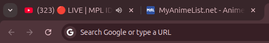

# Favicon

Saat membuka website seperti **Google**, **Facebook**, atau lainnya, biasanya di bagian **tab browser** terlihat logo kecil dari website tersebut.  
Logo kecil itulah yang disebut **favicon**.



---

## Cara Membuat Favicon di HTML

Untuk menambahkan favicon, kita perlu menaruh **tag `<link>`** di dalam bagian `<head>` pada file HTML.  
Tag tersebut menggunakan atribut:

- `rel="icon"` → menandakan bahwa file ini adalah favicon.  
- `href` → menunjukkan lokasi file gambar yang digunakan.  

Jenis file favicon bisa berupa: **.ico**, **.png**, **.jpg**, **.svg**, atau **.gif**.

---

## Contoh Kode Favicon

```html
<html>
  <head>
    <title>Belajar Favicon</title>
    <!-- Tambahkan favicon -->
    <link rel="icon" href="gambar/025-logo.jpg">
  </head>
  <body>
    <h1>Belajar Favicon</h1>
  </body>
</html>
````

---

✅ **Tips:**

* Ukuran favicon yang umum: **16×16 px** atau **32×32 px**.
* Format **.ico** lebih kompatibel di semua browser, tapi **.png** juga sering digunakan.